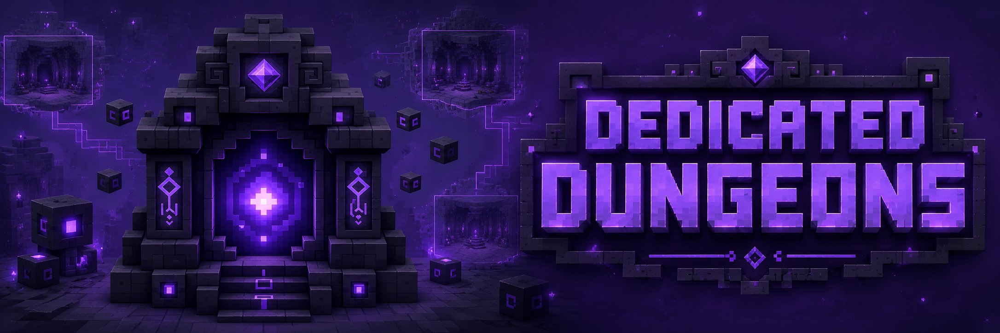

<p align="center">
  <a href="https://github.com/tracerxbrhd/dedicated-dungeons/releases"></a>
  <a href="https://github.com/tracerxbrhd/dedicated-dungeons/actions/workflows/build.yml"></a>
  <a href="https://modrinth.com/mod/dedicated-dungeons"></a>
  <a href="https://www.curseforge.com/minecraft/mc-mods/dedicated-dungeons"></a>
</p>

# Dedicated Dungeons

**Dedicated Dungeons is a NeoForge framework for isolated, procedurally assembled dungeon runs.** It combines structure-authored rooms, managed U-API instances, party deployment, data-driven encounters and configurable loot into a system intended for both players and modpack/datapack creators.

## Current release status

The current public line is **1.0.0-beta.1 for Minecraft 1.21.1**. The core dungeon flow is functional and released, but the mod currently focuses on the framework and creator tooling rather than shipping a large handcrafted content pack.

A small bundled dungeon, **Forgotten Depths**, acts as playable demonstration content and as a reference implementation for creators.

## Compatibility

- Minecraft **1.21.1**
- NeoForge **21.1.234+** within the 21.1 line
- Java **21**
- Requires **U-API 2.x**

## Features

- isolated dungeon instances with persistence, recovery and cleanup;
- procedural room and connector assembly;
- solo and party-ready deployment;
- data-driven dungeon definitions, encounters, mobs, bosses and loot;
- helper blocks for structure authoring;
- configurable mob distribution and reward pools;
- guarded optional entries for supported modded entities;
- operator commands and validation/debug tools for pack development.

## For modpack and datapack creators

Dedicated Dungeons is intentionally data-driven. Packs and servers can provide their own rooms, dungeon definitions, mob pools, bosses and loot profiles without modifying the mod itself.

See:

- [Datapack documentation](docs/DATAPACKS.md)
- [Release maintenance](docs/RELEASING.md)

## Building from source

```bash
./gradlew build
```

On Windows:

```powershell
gradlew.bat build
```

## License

Dedicated Dungeons source code is licensed under the [Mozilla Public License 2.0](LICENSE) (`MPL-2.0`). The Underworld Studio name, logos and branding are not licensed by the MPL.
